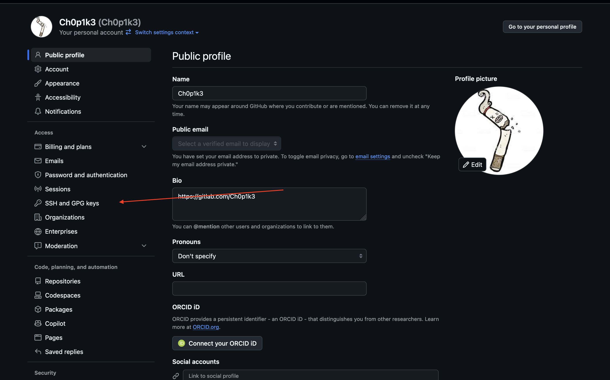

# Git and GitHub

## Как установить
- [Windows](https://git-scm.com/download/win/)
- [Linux](https://git-scm.com/download/linux)
- [MacOS](https://git-scm.com/download/mac)

## Как создать SSH ключ и добавить публичную его часть на Github
```bash
ssh-keygen -t rsa -b 2048
```
Создает ключ типа `rsa` размером 2048 байт.

Оно создаст вам два ключа (скорее всего в `~/.ssh`, не знаю путь на `Windows`): один с суффиксом `pub` - публичный, другой без суффикса - приватный; SSH-ключи нужны аутентификации в удаленный репозиторий. Публичный ключ нужно добавить в `Github`:
- Открывайте настройки;

- SSH and GPG keys;

- New SSH keys;
- Вводите удобный для вас title (нужен для того, чтобы после отличить из множества ключей этот самый добавленный);
- В Key вставляйте публичный ключ (файл с суффиксом `.pub`, например `id_rsa.pub`);
- `Add SSH key`
- Из терминала можно проверить подключение по `SSH`:
```bash
[10:14:27] chopik@chopik-os /Users/chopik/Desktop
> ssh git@github.com
The authenticity of host 'github.com (140.82.121.4)' can't be established.
ED25519 key fingerprint is SHA256:+DiY3wvvV6TuJJhbpZisF/zLDA0zPMSvHdkr4UvCOqU.
This key is not known by any other names.
Are you sure you want to continue connecting (yes/no/[fingerprint])? yes
Warning: Permanently added 'github.com' (ED25519) to the list of known hosts.
git@github.com: Permission denied (publickey).
[10:44:42] chopik@chopik-os /Users/chopik/Desktop [255]
> ssh-add -l
...
[10:44:52] chopik@chopik-os /Users/chopik/Desktop
> ssh-add ~/.ssh/id_rsa_github
Identity added: /Users/chopik/.ssh/id_rsa_github (ch00p.228@gmail.com)
[10:45:02] chopik@chopik-os /Users/chopik/Desktop
> ssh git@github.com
PTY allocation request failed on channel 0
Hi Ch0p1k3! You've successfully authenticated, but GitHub does not provide shell access.
Connection to github.com closed.
```

```bash
ssh-add -l
```
Показывает все доступные ключи в `ssh agent` - этот набор ключей будет использоваться для попыток авторизации в разные

```bash
ssh-add ~/.ssh/id_rsa
```
Добавление ключа приватного ключа в `ssh agent` (в агент добавляются только приватные ключи). С вашей стороны всегда должен быть добавлен приватный ключ, у стороны, которая авторизует вас.

Как видите, изначально ключ у меня не был добавлен, я его добавил и github авторизовал меня.

## Первые шаги
```bash
git config --global user.name "Ch0p1k3"
git config --global user.email "ch00p.228@gmail.com"
```
Установка имени и email, который будет отображаться в истории git.

## Базовые команды
- `git init` - инициализация репозитория;
- `git clone` - клонирование репозитория;
- `git add` - добавление файла в индекс;
- `git commit` - сделать коммит;
- `git status` - статус файлов в индексе;
- `git log` - лог со всеми сделанными коммитами;
- `git checkout` - переключение на другую ветку или сброс изменений в файле;
- `git branch` - вывести список веток и посмотреть на какой ты сейчас находишься;
- `git revert` - откатить коммит локально;
- `git merge` - мердж веток;
- `git pull` - подтянуть изменения из ветки;
- `git push` - залить изменения на удаленный репозиторий;

## Полезные ссылки
- [Git Pro](https://git-scm.com/book/en/v2) - книга по git, есть на русском
- [Классный тренажер](https://gitexercises.fracz.com/)
