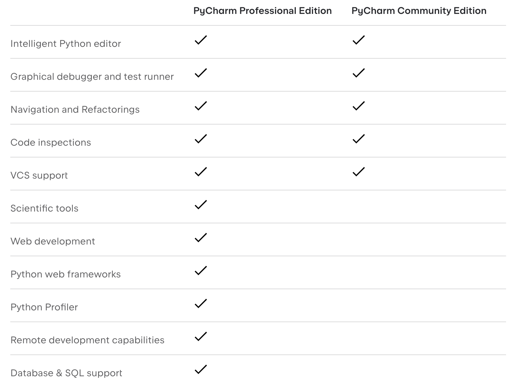
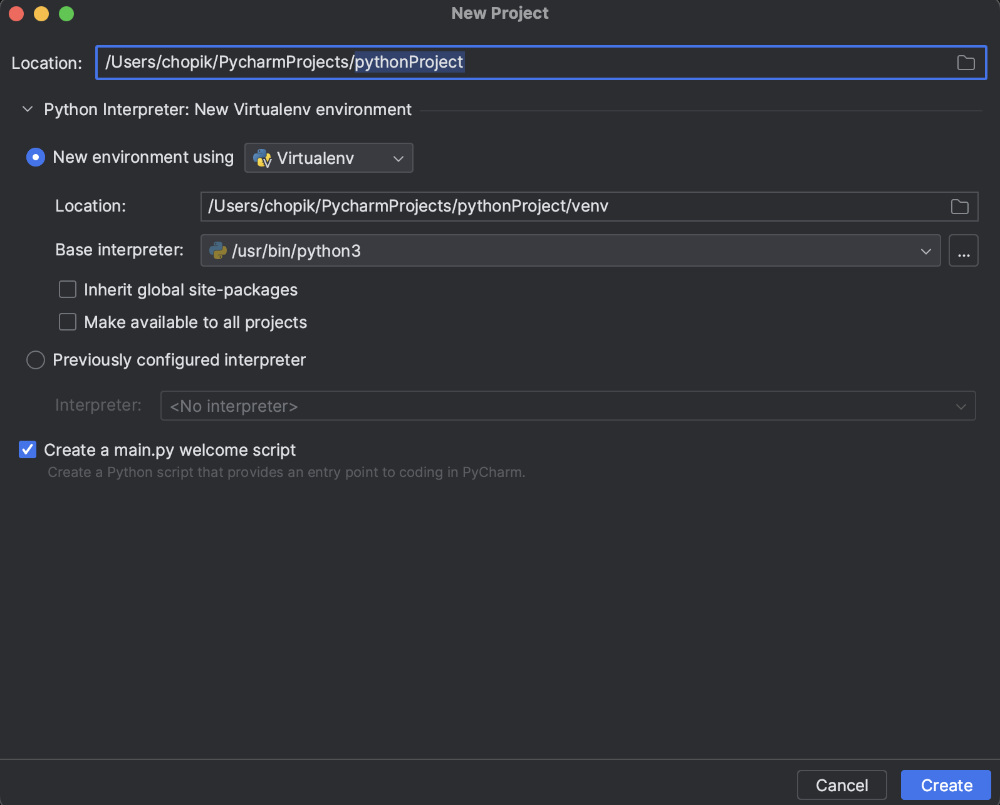
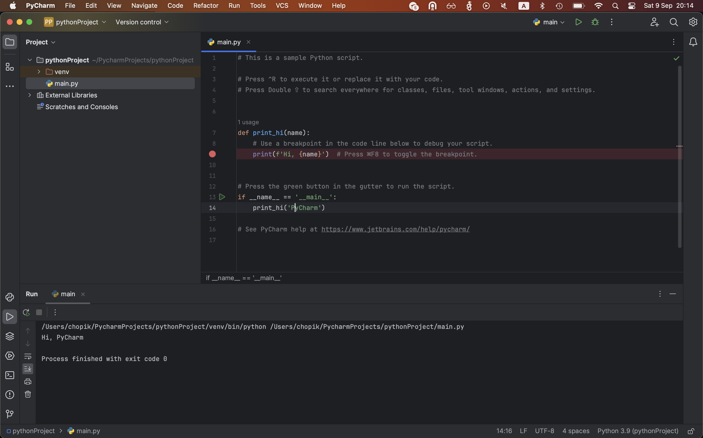

# JetBrains PyCharm Community

## Установка

Вообще есть две версии PyCharm: Professional Edition и Community Edition. Вот различия:

Вообще говоря, мне кажется, пока с головой хватит Community Edition и можно ее можно скачать по этой [ссылке](https://www.jetbrains.com/pycharm/download) (пролистайте чуть ниже, она там будет), но вообще можно [получить](https://www.jetbrains.com/community/education/#classrooms) лицензию на Professional Edition по корпоративной почте. Скачать вы можете по [этой же ссылке](https://www.jetbrains.com/pycharm/download), что и Community Edition.

Что важно помнить для людей с `MacOS` - не забудьте выбрать нужную версию, в зависимости от вашего процессора:
- `M1/M2` - нужна версия с допиской `(Apple Silicon)`
- `Intel` процессоры - нужна версия с допиской `(Intel)`

## После установки

После установки открывайте `PyCharm`, выбирайте `Do not import settings`, так как скорее всего у вас их нет. Создавайте новый проект, через кнопку `New project`. Выбирайте путь, где хотите создать проект, venv. Venv - это виртуальное окружение и об этом будет лекция, но сейчас подробнее можно узнать по этой [ссылке](https://docs.python.org/3/library/venv.html#module-venv).

Если у вас примерно тоже самое, что у меня на скриншоте, то у вас создаться проект с файлом `main.py`, который можно запустить через зеленую кнопку ▶️ и увидеть `Hello, PyCharm!`.

Все готово. Теперь можно создавать файлики, если слева нажмем по названию проекта (у меня это `pythonProject`) -> New -> File и запускать, не забывая выбирать рядом с кнопочкой запуска название этого файла.
